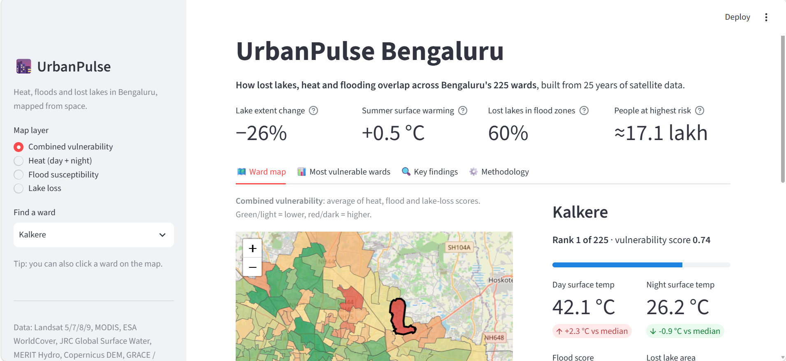
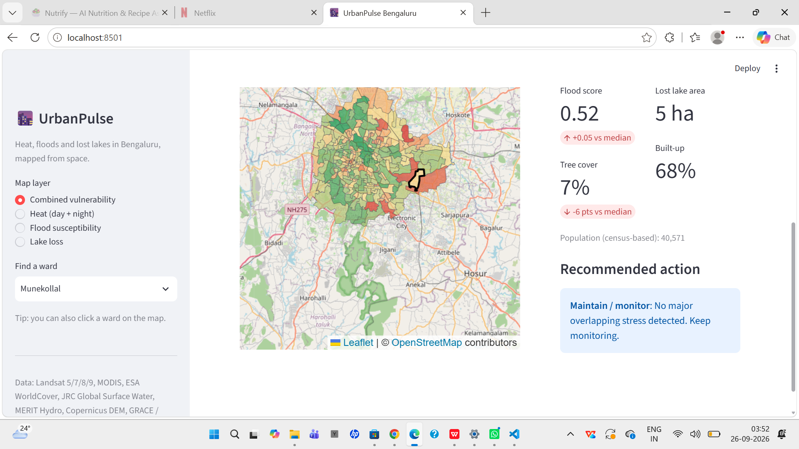
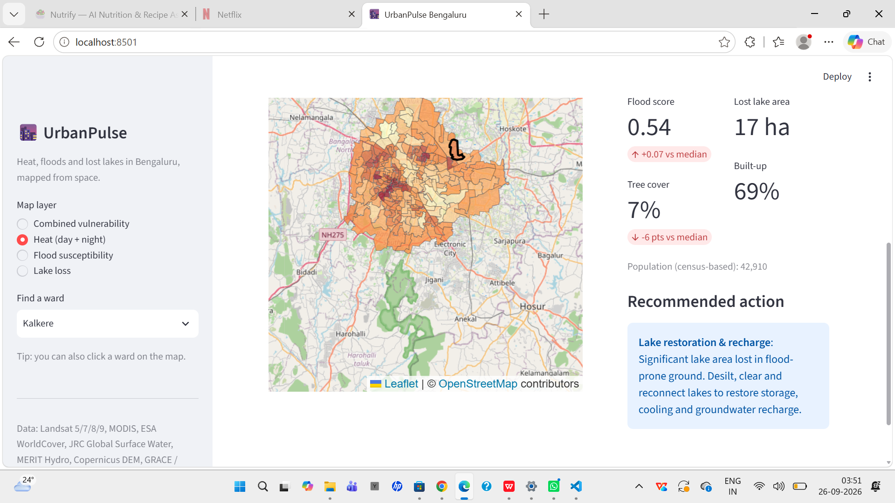
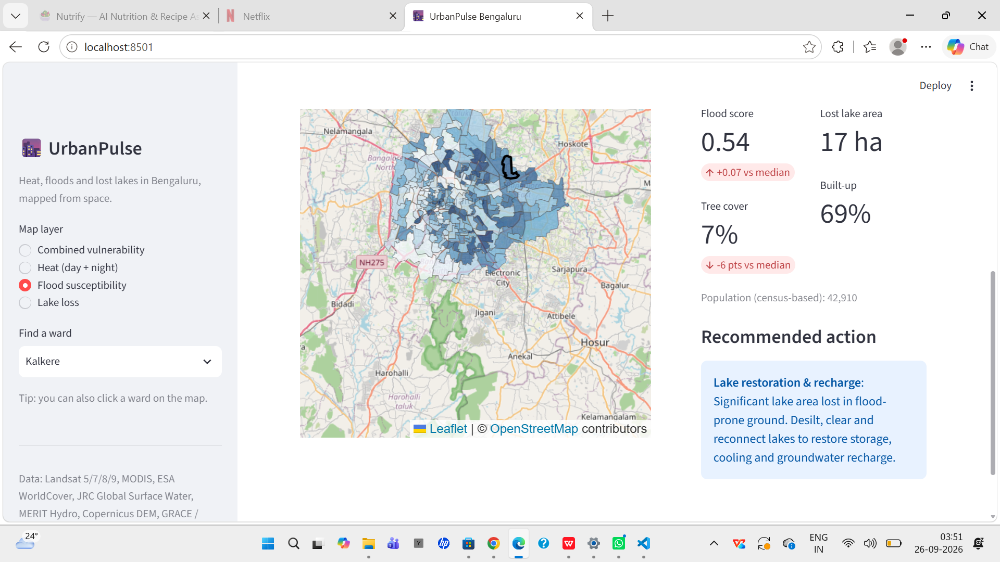
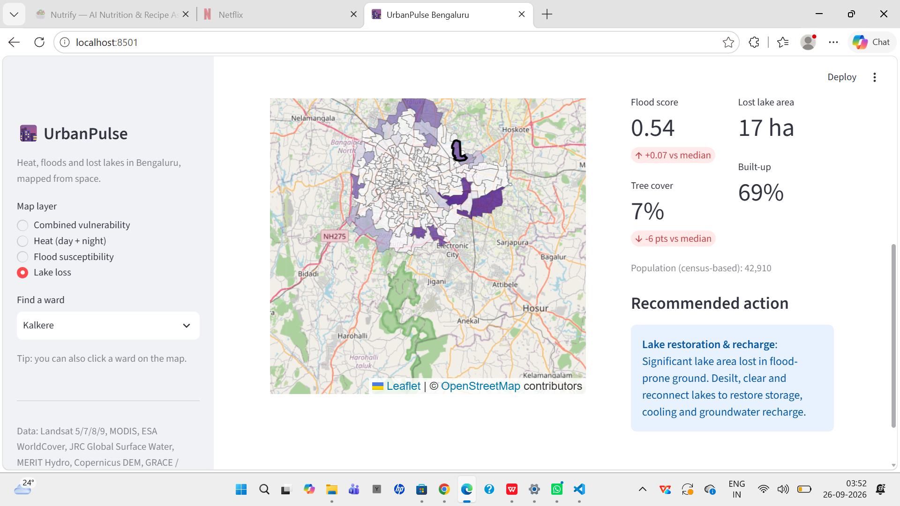
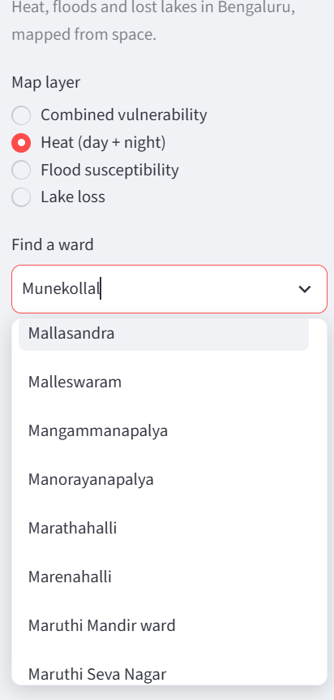
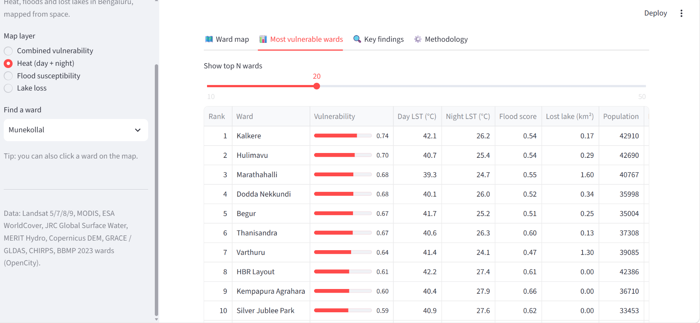
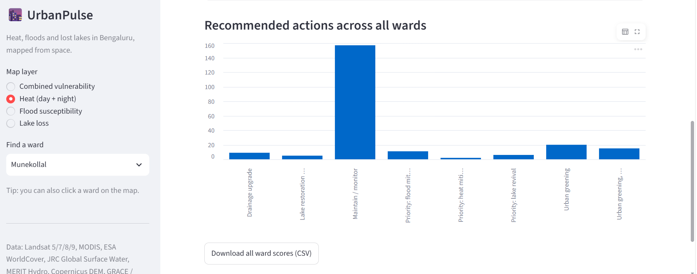
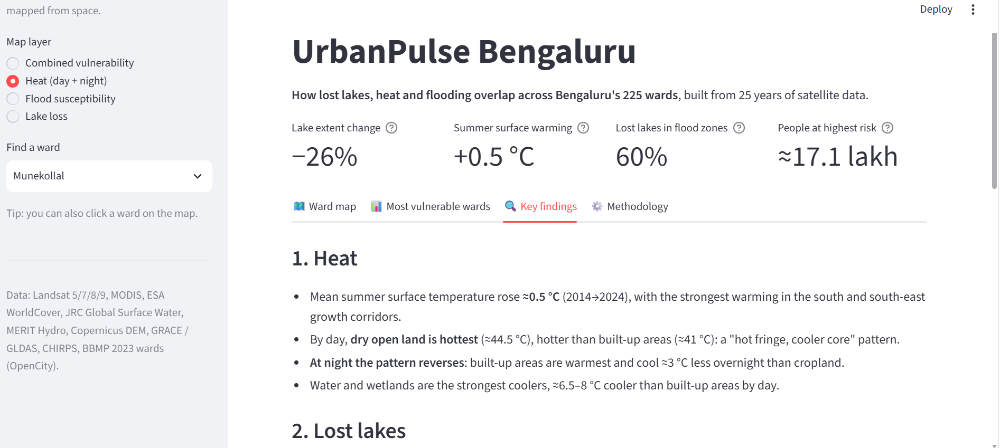

# 🌆 UrbanPulse Bengaluru

**Satellite-based analysis of lake loss, urban heat, flood risk and groundwater across Bengaluru's 225 BBMP wards.**

🔗 **Live dashboard:** _add your Streamlit link here_



---

## Screenshots

| Combined vulnerability | Heat (day + night) |
|---|---|
|  |  |
| **Flood susceptibility** | **Lake loss** |
|  |  |
| **Ward details and recommended action** | **Most vulnerable wards** |
|  |  |
| **Recommended actions across wards** | **Key findings** |
|  |  |

---

## Why this project

Bengaluru was once called the "city of lakes". In 2022 its tech corridors flooded, and in 2024 its borewells ran dry. UrbanPulse tests one idea with 25 years of satellite data: **losing lakes and green cover links the city's heat, flooding and water stress**, and it shows which wards need which fix.

## Key findings

| Theme | Finding |
|---|---|
| 🏞️ Lost lakes | Lake extent fell **≈26%** (≈45.8 → 33.8 km²) between 1999–2003 and 2020–2024 |
| 🌊 Flood risk | **60%** of lost-lake area lies in the top-20% flood-risk zone (3× chance); lost lakes sit ≈1.2 m above drainage vs ≈12.7 m city-wide |
| 🌳 Restorable | Only **≈1%** of lost-lake area is built over, so most lost lakes can still be restored |
| 🔥 Heat | Built-up areas are coolest-ranked by day but **warmest at night**, cooling ≈3 °C less overnight than open land |
| 💧 Groundwater | No significant regional decline (2003–2025); end-of-monsoon change tracks rainfall (**r ≈ 0.68**) |
| 🤖 ML | Random Forest predicts surface temperature with **R² ≈ 0.73** on spatially held-out areas; SHAP ranks bare/hard surfaces as the main heating factor |
| 🏘️ Wards | The 45 most vulnerable wards house **≈17 lakh people**; each ward gets a recommended action |

## Methods

1. **Urban heat.** Landsat 8/9 land surface temperature (2014 vs 2024), MODIS day/night comparison, and temperature by ESA WorldCover land class.
2. **Lost lakes.** MNDWI water frequency over 5-year windows, which avoids drought-year bias, validated against JRC Global Surface Water.
3. **Flood susceptibility.** Weighted index from MERIT Hydro HAND, slope, upstream area and built-up density.
4. **Groundwater.** GLDAS CLSM (GRACE-assimilated) and GRACE/GRACE-FO, with a Mann-Kendall trend test and correlation with CHIRPS rainfall.
5. **ML heat drivers.** Random Forest with spatial block cross-validation and SHAP explanations.
6. **Ward vulnerability index.** Percentile-ranked heat, flood and lake-loss scores for 225 wards, with rule-based recommended actions.

## Tech stack

Google Earth Engine · geemap · GeoPandas · scikit-learn · SHAP · pymannkendall · Streamlit · Folium

## Run locally

```bash
pip install -r requirements.txt
streamlit run app.py
```

## Repository structure

```
├── app.py                      # Streamlit dashboard
├── urbanpulse_wards.geojson    # ward-level results (225 wards)
├── requirements.txt
├── notebooks/
│   └── UrbanPulse_Bengaluru.ipynb   # full analysis
└── images/                     # screenshots and maps
```

## Limitations

- Land surface temperature is not air temperature.
- Some "lost" lakes may be weed-covered rather than drained.
- Satellite groundwater data is regional (≈27 km) and cannot resolve individual borewells.
- Ward populations are census-based estimates.
- Index weights are transparent assumptions, not calibrated against observed flood events.

## Data sources

Landsat 5/7/8/9 (USGS), MODIS MOD11A2 (NASA), ESA WorldCover, JRC Global Surface Water, MERIT Hydro, Copernicus DEM, GLDAS & GRACE (NASA), CHIRPS (UCSB), BBMP 2023 ward boundaries (OpenCity).
